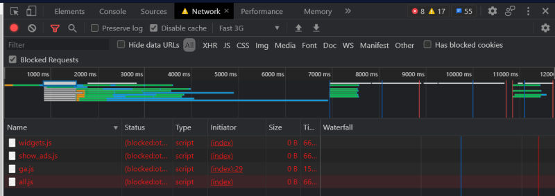

# Performance Analysis

&nbsp;
_Competitor site analized in this document: [todolistme.net](http://todolistme.net/)_

---

&nbsp;

With a performance test we can see that our app is loading very fast in compare to [competitor site](http://todolistme.net/) and have no issues. The [competitor site](http://todolistme.net/) is loading slow at the very start where we first see a blank page for some time. Our page loads straight to the list very fast. Slower performance of [competitor site](http://todolistme.net/) is also do to more complex design and more content to load.

&nbsp;

&nbsp;

The speed index of [competitor site](http://todolistme.net/) is not so good because visible content needs some time to populate the page.

At [competitor site](http://todolistme.net/) is 26 static resources that are not cached and 2 have very short cache time. Because of it, Largest Contentful Paint is very slow. A longer cache lifetime and cache of more resources can speed up repeat visits to the page especially with a third-party resources.

---

&nbsp;

## What network analysis showed?

&nbsp;

When we compare network performance we can see that on the first load [Competitor site](http://todolistme.net/) needs almost 12 seconds to load in compare to our site 2 seconds. That is slow. Our site loads in 2 seconds on first and every other load. That is good.

&nbsp;

&nbsp;

There is few requests on [Competitor site](http://todolistme.net/) to Facebook, Twitter and Google that are blocked. I guess with all that working user experience would be much better.

&nbsp;

---

&nbsp;

## What we can learn from Competitor

&nbsp;

[Competitor site](http://todolistme.net/) have more features then our app like saving different lists, adding to-do's for specific dates, sorting of the list, categories, drag and drop and printing option.

One of the things for future upgrades on which one we should pay attention is the leverage of the font-display CSS feature to ensure text is user-visible while web fonts are loading. That is one way to avoid a blank page at the beginning of loading and to speed the page to load up.

The second thing to improve can be reducing JavaScript execution time. That means a revision of the code and make him execute only when needed. That is especially important on the first load when it is not needed for all code to be executed if it is not needed to do anything at the moment.

Since this page uses HTTP/1.1 protocol that will lead to slower loading time. The suggestion is that for all future upgrades we always use the HTTP/2 protocols.

Image elements on this site do not have their explicit width and height and that can cause page loading to be messy with text going all over the place while with every image load page will reflow. By giving every image an explicit width and height, the browser will know the aspect ratio of the image which will allow the browser to calculate and reserve sufficient space for the height and associated area. That way user experience is much better.

---
