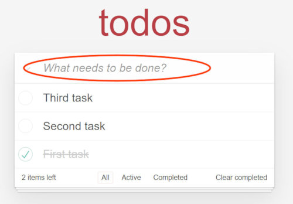
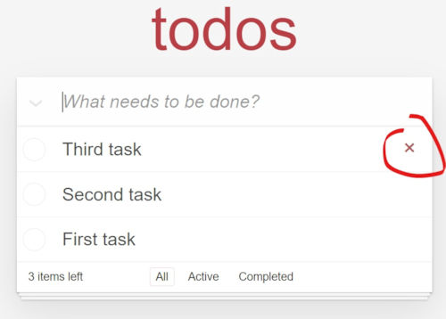
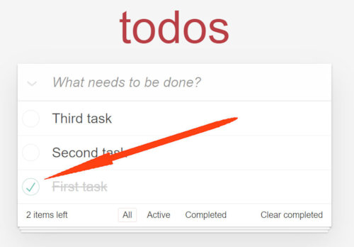
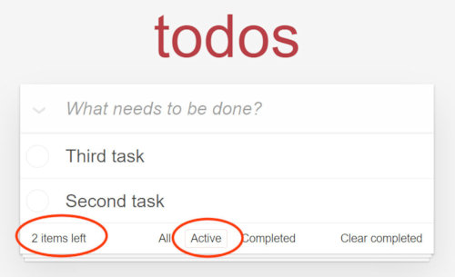
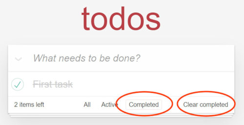
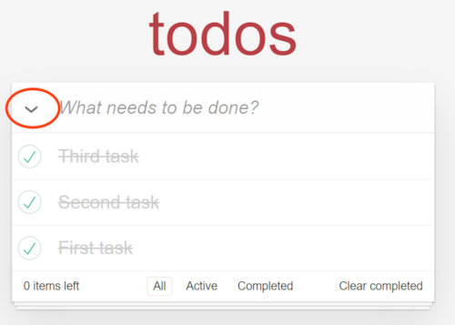

# Technical Documentation

&nbsp;

Product Name: <mark>_**todos**_</mark>

Product Version: **1.0.1**

Product Phase: **Launch**

Current Date: **2021-04-13**

---

&nbsp;

### **Product Overview** 👀

&nbsp;

<mark>_**todos**_</mark> is a simple light to-do list application to keep all your tasks you want to do in one place. The idea is to make it as simple as possible without any extra fancy features which in many cases can just overcomplicate the use of something that was always meant to be simple to use.

---

&nbsp;

### **Product Objectives** 🎯

&nbsp;

<mark>_**todos**_</mark> help you keep track of your tasks planned to do. Not to worry if you will lose your list written on paper by simply saving it on your computer. In this document is explained how to use with maximum efficiency.

---

&nbsp;

### **Table of Contents** ⚓

&nbsp;

\- Product Overview 👀 
\- Product Objectives 🎯 
\- Table of Contents ⚓ 
\- Creating new todos list item ✔️ 
\- Removing a list item from the list ✔️ 
\- Marking a task as completed ✔️ 
\- Showing only active tasks✔️ 
\- Showing only completed tasks ✔️ 
\- Toggle all completed or active ✔️ 
\- Frequently Asked Questions (FAQs) 🙋🏽‍♂️ 
\- Technical Support Contact Information 💬

---

&nbsp;

### **Creating new todos list item** ✔️

&nbsp;

By simply typing your next task into the box that says "What needs to be done?" and hitting the "Enter" key your new to-do in your <mark>_**todos**_</mark> list will be created.

---

&nbsp;

### **Removing a list item from the list** ✔️

&nbsp;

When you hover over the list item an "X" button will show up on the right. Clicking on the button will remove that specific <mark>_**todos**_</mark> task from the list.

---

&nbsp;

### **Marking a task as completed** ✔️

&nbsp;

Clicking the button on the left side of the list item will mark that task as completed.

---

&nbsp;

### **Showing only active tasks** ✔️

&nbsp;

Clicking on the "Active" button, only active <mark>_**todos**_</mark> list tasks will be shown.

In the left bottom corner is a counter that always shows the total count of still active tasks.

---

&nbsp;

### **Showing only completed tasks** ✔️

&nbsp;

Clicking on the "Completed" button, only completed <mark>_**todos**_</mark> list tasks will be shown.

With the "Clear completed" button you can remove all completed tasks with one click.

---

&nbsp;

### **Toggle all completed or active** ✔️

&nbsp;

Clicking on the top right button on the left of input box you can toggle all tasks status to completed or to active.

---

&nbsp;

### **Frequently Asked Questions (FAQs)** 🙋🏽‍♂️

&nbsp;

**- Question:** If by accident I move away from the page, will my tasks stay saved?

    Yes, all tasks are saved in local browser memory and when you return on the page they will be there.

**- Question:** How many tasks I can make?

    There is no limit on how many tasks you can make.

**- Question:** Can I make different lists instead of having only one?

    No, sorry, but that feature is planed for next version of the application.

---

&nbsp;

### **Technical Support Contact Information** 💬

&nbsp;

If you have additional questions abot <mark>_**todos**_</mark> application, want more information or just need to talk to a support agent, send an email to this address: support@todos.com

---

&nbsp;
